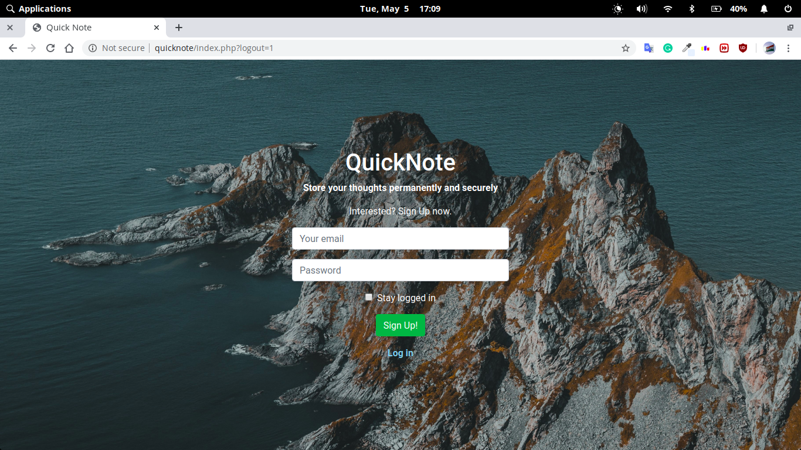
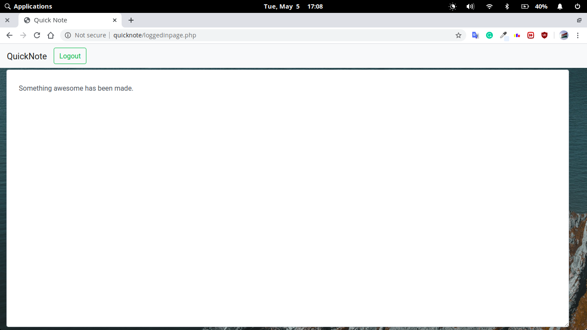

**This is a complete web app involving user log in, sign up, database connectivity, session variable etc. with usual HTML, CSS, jQuery, php, mysql. **
*Users can store their thoughts quickly and securely*
### Highlights
1. Create your own account and decide to stay logged in for a while.
2. Cookies here doesn't track your browsing patterns.
3. Get your note saved automatically as soon as you write it.
4. You can store your thoughts and view them later.
5. Your password is secured using md5() password hashing .
6. Beautiful BootStrap4 styling.
7. A good log in system that you can use for any website.

### Screenshots:

